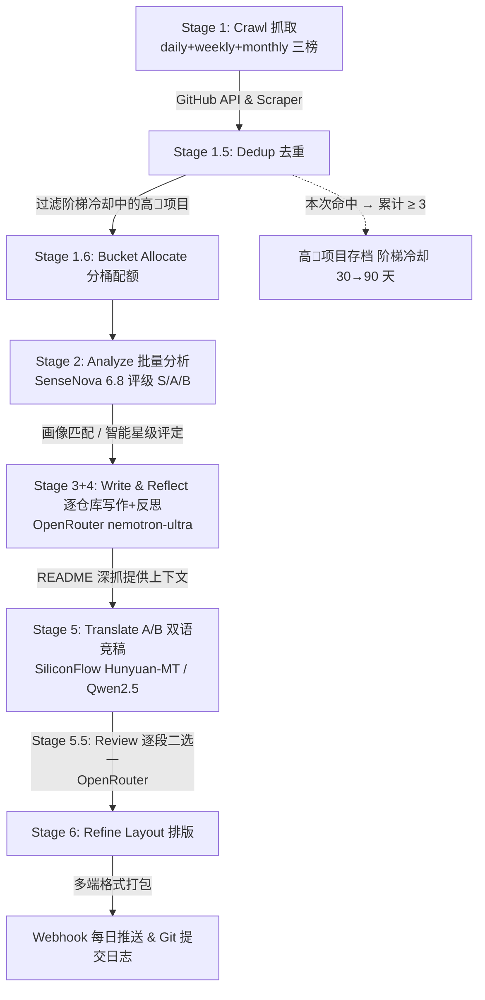

# 🌌 auto_github: 开源趋势与大厂动态 AI 智能体策展系统

<p align="center">
  <a href="https://github.com/Golden0Voyager/auto_github/actions/workflows/daily_trending.yml">
    
  </a>
  <a href="https://github.com/Golden0Voyager/auto_github">
    
  </a>
  <a href="https://github.com/Golden0Voyager/auto_github/blob/main/LICENSE">
    
  </a>
</p>

一个基于“策展思维”设计的高审美、低信噪比开源趋势与大厂动态监测系统。它能够每日自动抓取 GitHub 热门项目及 LLM 大厂的最新动态，通过 **OpenRouter + SenseNova + SiliconFlow 多供应商混合驱动**的“抓取 - 去重 - 分桶 - 分析 - 写作反思 - 双语翻译 - 评审 - 排版”智能体管线，最终输出为精美且富有技术深度的多维画像评级报告。

---

## 🎨 策展设计理念
- **信息降噪即“展位控制”**：过滤冗余的 README 搬运，只选择真正具有架构创新（如 MLA 优化、MoE、KV-Cache、强化学习对齐等）的硬核开源更新。
- **高🌟项目去重**：自动追踪每个项目的出现频次；对于累计出现 ≥ 3 次且 star ≥ 10k 的「常驻高星项目」，自动进入**阶梯冷却**存档(30/45/60… 天递增,封顶 90 天)，把策展位腾给新兴项目。
- **多端触点即“展陈转译”**：输出针对不同阶段画像（初阶入门、中阶实践、高阶大神）深度定制的报告，且排版经过美学精修，完美支持飞书卡片、Slack Block Kit 及高颜值 Markdown。
- **透明审计与反思**:写作由 OpenRouter(nemotron-ultra)在 prompt 约束下完成自我审校;翻译走 A/B 双模型(Hunyuan-MT / Qwen2.5)竞稿,再由 reviewer 逐段二选一比稿,杜绝空泛的 AI 腔调宣传词。

---

## 🔄 多阶段智能体管线架构



---

## 📂 项目结构

```
auto_github/
├── .github/workflows/
│   └── daily_trending.yml      # GitHub Actions 每日自动流 (北京时间上午10:00运行)
├── config/
│   ├── config.yaml             # 系统基础配置 (监测目标、大厂列表、模型、去重策略)
│   └── personas.yaml           # Beginner / Intermediate / Advanced 画像 prompt
├── reports/
│   ├── latest_daily.md         # 最新生成的每日策展报告
│   ├── daily_YYYY-MM-DD.md     # 历史策展报告归档
│   ├── repo_history.json       # 项目出现日期历史 (dedup 状态)
│   ├── high_star_archive.json  # 冷却中的高🌟项目存档 (dedup 状态)
│   └── repo_cycles.json        # 归档轮次计数 (阶梯冷却用,dedup 状态)
├── src/
│   ├── config.py               # Pydantic 配置引擎 + 多 provider 路由表
│   ├── crawler.py              # GitHub Trend HTML 爬虫 & API 客户端
│   ├── dedup.py                # 高🌟项目存档追踪器 (阶梯冷却 + 留展位)
│   ├── llm.py                  # LLM 网关 (多 provider + 429 指数退避 + fallback 模型)
│   ├── pipeline.py             # 多阶段编排 (分桶/翻译竞稿/评审 + JSON 容错)
│   ├── formatter.py            # 排版渲染器 (飞书/Slack/Markdown)
│   ├── notifier.py             # Webhook 分发与本地写入
│   └── main.py                 # CLI 入口
├── templates/
│   ├── feishu_card.json.j2     # 飞书卡片 Jinja2 模板
│   ├── slack_blocks.json.j2    # Slack blocks Jinja2 模板
│   └── report.md.j2            # Markdown 报告 Jinja2 模板
├── pyproject.toml              # 依赖声明 + ruff/pytest/coverage 配置
├── uv.lock                     # uv 锁定文件 (Dependabot 扫描对象)
├── requirements.txt            # CI 安装清单
└── README.md                   # 本说明文档
```

---

## 👥 策展画像支持

系统目前深度定制了三种核心画像：
1. **初阶入门者 (`beginner`)**：侧重“这能帮我干什么”，通俗易懂地解释名词，重点挑选带 WebUI、开箱即用的现成应用。
2. **中阶实践者 (`intermediate` - 默认画像)**：面向**系统化 LLM 学习者与 Vibecoding 重度用户**，侧重**工程落地、Agent 协作拓扑、RAG 降噪、MCP 插件、ComfyUI 精细化图像干预及开发效率工具（如 Claude Code, rtk 等）**，关注 Token 经济学与微体验。
3. **高阶学术大神 (`advanced`)**：关注 **MoE/MLA 底层模型架构、强化学习算法 (DPO/PRO/R1)、推理期树搜索 (MCTS) 及 CUDA 算力吞吐极限**，使用硬核高密度的学术语系。

---

## ⚙️ 快速接入指南

### 1. 初始化本地环境
```bash
# 一键装依赖(uv 自动建 venv 并按 uv.lock 锁版本)
uv sync

# 跑测试套件(~310 用例,coverage 门槛 85%)
uv run pytest tests/ --cov
```

### 2. 配置环境变量
在项目根目录创建 `.env` 文件：
```bash
# 三把 LLM 密钥(缺一即对应通道静默降级,不中断管线)
SENSENOVA_API_KEY="sk-your-sensenova-key"   # 分类评级 classifier(Token Plan 端点)
OPENROUTER_API_KEY="sk-or-your-openrouter-key"  # 写作 writer + 评审 reviewer
SILICONFLOW_API_KEY="sk-your-siliconflow-key"   # 翻译 translator_a/b
# 各 provider 端点已内置(src/config.py),如需自定义可覆盖
# SENSENOVA_BASE_URL / OPENROUTER_BASE_URL / SILICONFLOW_BASE_URL

# (可选) 飞书 webhook 地址 (如有)
FEISHU_WEBHOOK_URL="https://open.feishu.cn/open-apis/bot/v2/hook/xxx"

# (可选) GitHub Token，用于避开 GitHub API 速率限制 (Actions 运行时会自动注入)
GITHUB_TOKEN="your-github-token"
```

### 3. 本地命令行运行

```bash
# 1. 以中阶画像运行一次离线沙盒模拟 (0 消耗 token，快速验证排版与通知链路)
python src/main.py --mock --persona intermediate

# 2. 真实抓取数据并调用 LLM 进行 S/A/B 级策展总结
python src/main.py --since daily --persona intermediate

# 3. 生成高阶学术报告
python src/main.py --since weekly --persona advanced
```

---

## 🚀 GitHub Actions 线上定时自动运行

本仓库已布设好 GitHub Actions 工作流：
1. **定时触发**：每天 UTC 02:00 (北京时间上午 10:00) 自动运行。
2. **Git 归档日志**:生成报告后,工作流会将 Markdown 报告以 `[skip ci]` 方式自动 commit 并 push 到 **`auto-docs` 孤儿分支**(`reports/latest_daily.md` 常驻该分支),main 保留历史报告,形成不可篡改的开源技术史记看板。
3. **推送 Webhook**：自动向绑定的飞书、Slack 或 Discord 机器人推送经过视觉美化排版的互动消息。

### 配置 Actions 密钥 (GitHub Secrets)
在 GitHub 仓库的 `Settings` -> `Secrets and variables` -> `Actions` 下添加以下机密信息：
- `SENSENOVA_API_KEY`: 商汤 SenseNova Token Plan API 密钥(classifier 通道)。
- `OPENROUTER_API_KEY`: OpenRouter 密钥(writer + reviewer 通道)。
- `SILICONFLOW_API_KEY`: 硅基流动密钥(translator_a/b 翻译通道)。
- `FEISHU_WEBHOOK_URL`: (可选) 飞书机器人 webhook 地址。
- `SLACK_WEBHOOK_URL`: (可选) Slack 机器人 webhook 地址。
- `DISCORD_WEBHOOK_URL`: (可选) Discord 机器人 webhook 地址。

> 三家 provider 端点均已内置(`src/config.py`),无需配置 Base URL。
> 注意:新增 provider 时需同步 GitHub Secrets **和** workflow `env:` 注入,缺一即该通道拿不到 key。

---

## 🌟 高星项目去重（算力 + 展位双优）

为避免每天重复推送同一个老牌高星项目浪费 LLM 配额与读者注意力，系统会自动维护一个 **高🌟项目存档**：

- **触发条件**:项目 `star ≥ 10000` 且**累计出现次数 ≥ 3**(默认阈值,可在 `config/config.yaml` 的 `dedup` 段调整)。
- **阶梯冷却**:第 k 次归档冷却 `30 × max(1, 1+0.5(k-1))` 天(30 → 45 → 60 …),封顶 90 天。越「常青」的项目让位越久。
- **复活机制**:冷却期结束后,若该项目再次进入 trending 列表,将重新进入策展管线(轮次计数保留在 `repo_cycles.json`)。
- **首次出现窗口**:90 天内没出现过才算 Early Bird(新面孔),是分桶配额与评级的依据之一。
- **历史数据**:持久化到 `repo_history.json` / `high_star_archive.json` / `repo_cycles.json` 三个状态文件,可随时 `git log` 回溯。

调整示例（`config/config.yaml`）：
```yaml
dedup:
  high_star_threshold: 5000   # 降低 → 更激进地存档
  archive_threshold: 5       # 提高 → 需要更多次出现才存档
  archive_cooldown_days: 60  # 延长 → 给新兴项目更多曝光机会
```
