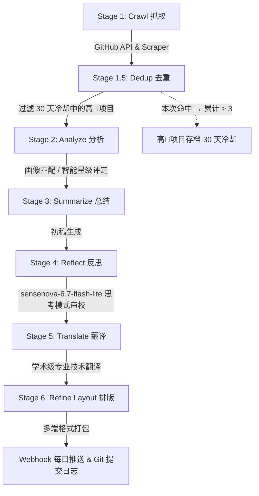

# 🌌 auto_github: 开源趋势与大厂动态 AI 智能体策展系统

<p align="center">
  <a href="https://github.com/Golden0Voyager/auto_github/actions/workflows/daily_trending.yml">
    
  </a>
  <a href="https://github.com/Golden0Voyager/auto_github">
    
  </a>
  <a href="https://github.com/Golden0Voyager/auto_github/blob/main/LICENSE">
    
  </a>
</p>

一个基于“策展思维”设计的高审美、低信噪比开源趋势与大厂动态监测系统。它能够每日自动抓取 GitHub 热门项目及 LLM 大厂的最新动态，通过由商汤 SenseNova **Token Plan** 驱动的“抓取 - 去重 - 分析 - 总结 - 反思 - 翻译 - 排版”六阶段智能体管线，最终输出为精美且富有技术深度的多维画像评级报告。

---

## 🎨 策展设计理念
- **信息降噪即“展位控制”**：过滤冗余的 README 搬运，只选择真正具有架构创新（如 MLA 优化、MoE、KV-Cache、强化学习对齐等）的硬核开源更新。
- **高🌟项目去重**：自动追踪每个项目的出现频次；对于累计出现 ≥ 3 次且 star ≥ 10k 的「常驻高星项目」，自动进入 30 天冷却的存档列表，把策展位腾给新兴项目。
- **多端触点即“展陈转译”**：输出针对不同阶段画像（初阶入门、中阶实践、高阶大神）深度定制的报告，且排版经过美学精修，完美支持飞书卡片、Slack Block Kit 及高颜值 Markdown。
- **透明审计与反思**：利用 **sensenova-6.7-flash-lite** 思考模式反思每一份初稿，严厉核实所有技术专有名词，杜绝空泛的 AI 腔调宣传词。

---

## 🔄 7-Stage 智能体管线架构



---

## 📂 项目结构

```
auto_github/
├── .github/workflows/
│   └── daily_trending.yml      # GitHub Actions 每日自动流 (北京时间上午9:00运行)
├── config/
│   ├── config.yaml             # 系统基础配置 (监测目标、大厂列表、模型、去重策略)
│   └── personas.yaml           # Beginner / Intermediate / Advanced 画像 prompt
├── reports/
│   ├── latest_daily.md         # 最新生成的每日策展报告
│   ├── daily_YYYY-MM-DD.md     # 历史策展报告归档
│   ├── repo_history.json       # 项目出现日期历史 (dedup 状态)
│   └── high_star_archive.json  # 30 天冷却中的高🌟项目存档
├── src/
│   ├── config.py               # Pydantic 配置引擎
│   ├── crawler.py              # GitHub Trend HTML 爬虫 & API 客户端
│   ├── dedup.py                # 高🌟项目存档追踪器 (节省算力 + 留展位)
│   ├── llm.py                  # LLM 网关 (内置 429 频率限流指数退避)
│   ├── pipeline.py             # 6-Stage 核心流程调度
│   ├── formatter.py            # 排版渲染器 (飞书/Slack/Markdown)
│   ├── notifier.py             # Webhook 分发与本地写入
│   └── main.py                 # CLI 入口
├── templates/
│   ├── feishu_card.json.j2     # 飞书卡片 Jinja2 模板
│   ├── slack_blocks.json.j2    # Slack blocks Jinja2 模板
│   └── report.md.j2            # Markdown 报告 Jinja2 模板
├── requirements.txt            # 项目依赖
└── README.md                   # 本说明文档
```

---

## 👥 策展画像支持

系统目前深度定制了三种核心画像：
1. **初阶入门者 (`beginner`)**：侧重“这能帮我干什么”，通俗易懂地解释名词，重点挑选带 WebUI、开箱即用的现成应用。
2. **中阶实践者 (`intermediate` - 默认画像)**：面向**系统化 LLM 学习者与 Vibecoding 重度用户**，侧重**工程落地、Agent 协作拓扑、RAG 降噪、MCP 插件、ComfyUI 精细化图像干预及开发效率工具（如 Claude Code, rtk 等）**，关注 Token 经济学与微体验。
3. **高阶学术大神 (`advanced`)**：关注 **MoE/MLA 底层模型架构、强化学习算法 (DPO/PRO/R1)、推理期树搜索 (MCTS) 及 CUDA 算力吞吐极限**，使用硬核高密度的学术语系。

---

## ⚙️ 快速接入指南

### 1. 初始化本地环境
```bash
# 创建虚拟环境并激活
python3 -m venv .venv
source .venv/bin/activate

# 安装项目依赖
pip install -r requirements.txt
```

### 2. 配置环境变量
在项目根目录创建 `.env` 文件：
```bash
# 商汤 SenseNova Token Plan API 密钥 (sensenova-6.7-flash-lite 每 5h 配额 1500 次)
SENSENOVA_API_KEY="sk-your-sensenova-key"
# Token Plan 端点已默认，可不设置；如需自定义可覆盖
# SENSENOVA_BASE_URL="https://token.sensenova.cn/v1"

# (可选) 飞书 webhook 地址 (如有)
FEISHU_WEBHOOK_URL="https://open.feishu.cn/open-apis/bot/v2/hook/xxx"

# (可选) GitHub Token，用于避开 GitHub API 速率限制 (Actions 运行时会自动注入)
GITHUB_TOKEN="your-github-token"
```

### 3. 本地命令行运行

```bash
# 1. 以中阶画像运行一次离线沙盒模拟 (0 消耗 token，快速验证排版与通知链路)
python src/main.py --mock --persona intermediate

# 2. 真实抓取数据并调用 LLM 进行 S/A/B 级策展总结
python src/main.py --since daily --persona intermediate

# 3. 生成高阶学术报告
python src/main.py --since weekly --persona advanced
```

---

## 🚀 GitHub Actions 线上定时自动运行

本仓库已布设好 GitHub Actions 工作流：
1. **定时触发**：每天 UTC 02:00 (北京时间上午 10:00) 自动运行。
2. **Git 归档日志**：生成报告后，工作流会自动将生成的 Markdown 报告存入 `reports/` 目录下，并以 `[skip ci]` 方式自动 commit 并 push 回本仓库，形成不可篡改的**开源技术史记看板**。
3. **推送 Webhook**：自动向绑定的飞书、Slack 或 Discord 机器人推送经过视觉美化排版的互动消息。

### 配置 Actions 密钥 (GitHub Secrets)
在 GitHub 仓库的 `Settings` -> `Secrets and variables` -> `Actions` 下添加以下机密信息：
- `SENSENOVA_API_KEY`: 您的商汤 SenseNova Token Plan API 密钥（`sk-xxx` 格式）。
- `FEISHU_WEBHOOK_URL`: (可选) 飞书机器人 webhook 地址。
- `SLACK_WEBHOOK_URL`: (可选) Slack 机器人 webhook 地址。
- `DISCORD_WEBHOOK_URL`: (可选) Discord 机器人 webhook 地址。

> Token Plan 端点 `https://token.sensenova.cn/v1` 已硬编码在 workflow 中，无需额外配置 Base URL。

---

## 🌟 高星项目去重（算力 + 展位双优）

为避免每天重复推送同一个老牌高星项目浪费 LLM 配额与读者注意力，系统会自动维护一个 **高🌟项目存档**：

- **触发条件**：项目 `star ≥ 10000` 且**累计出现次数 ≥ 3**（默认阈值，可在 `config/config.yaml` 的 `dedup` 段调整）。
- **冷却期**：进入存档后 **30 天内不再推送**该项目的策展内容。
- **复活机制**：冷却期结束后，若该项目再次进入 trending 列表，将重新进入策展管线（同时历史日期计数保留，避免立即重新触发存档）。
- **历史数据**：每次运行结果持久化到 `reports/repo_history.json` 与 `reports/high_star_archive.json`，可随时 `git log` 回溯。

调整示例（`config/config.yaml`）：
```yaml
dedup:
  high_star_threshold: 5000   # 降低 → 更激进地存档
  archive_threshold: 5       # 提高 → 需要更多次出现才存档
  archive_cooldown_days: 60  # 延长 → 给新兴项目更多曝光机会
```
